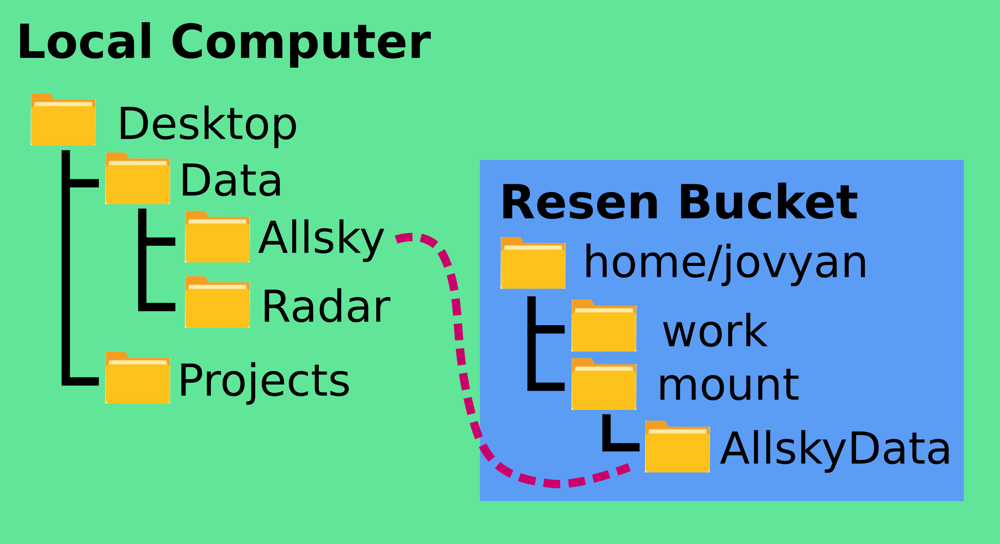

.. _mounting:

Mounting
********

Mounting directories is a confusing topic if you've never done it before.  This page describes what mounting is, why and how you mount directories into buckets, and some frequent asked questions regarding mounting directories to resen buckets.

What's the deal with mounting?
==============================

When you create a bucket, you have the option to mount local directories into the bucket, but what does this actually mean?  Buckets are self-contained "mini-systems" that are isolated from the rest of your system.  This allows us to have an environment and workspace that is operating system agnostic, which is highly useful for reproducing and sharing scientific results.  The downside to this is that you cannot usually access any files on your local (host) system, a significant roadblock for scientists who often work with large amounts of data and reuse standard scripts and utilities they've written for multiple projects.  Mounting is the standard solution to these problems.

Mounting a directory to a bucket gives the bucket sub-system access to that directory on the local system.  This is typically useful if your project involves analyzing a large amount of data you have on your local computer, or if you have some set of standard scripts or utilities you would like to be able to use in your project.  Mounting the directory containing these files lets you use them in your bucket.

Mounting a directory in Resen
=============================

The ``create`` command at the resen prompt allows you to mount local directories to the bucket that is being created.  After entering the bucket name and choosing a version of resen-core, you will be given to option to mount local directories::

  Local directories can be mounted to /home/jovyan/mount in a bucket.  You can specify either r or rw privileges for each directory mounted.
  >>> Mount storage to /home/jovyan/mount? (y/n):

If you would like to mount local directories, enter ``y``.  The tool will then ask to you specify the local path::

  >>> Enter local path:

This should be a VALID path on your local computer, something like ``/users/my_username/Desktop/Data/AllSkyImager``.  The resen tool will check to confirm that this is a valid path; if it cannot find the path you entered, it will ask you to enter the local path again.

Next, resen will ask you to enter the bucket path::

  >>> Enter bucket path:

This is the location where you will be able to find the directory you mounted within the bucket.  The path you enter MUST start with ``/home/jovyan/mount``, but then can be any directory structure you choose, for instance ``/home/jovyan/mount/AllSkyImagerData``.  The name of the directory in the bucket file system need not be the same as its name in the local files system (you can mount the local directory ``/users/my_username/Desktop/Dinosaurs/TRex`` to the bucket location ``/home/jovyan/mount/Alpaca``).

The resen will then ask if you would like the mounted directory to have read only or read/write permissions::

  >>> Enter permissions (r/rw):

Enter either ``r`` for read only or ``rw`` for read/write.

Finally, resen will ask if you would like to mount any additional storage::

  >>> Mount additional storage to /home/jovyan/mount? (y/n):

If you have additional directories you would like to mount, enter ``y`` and repeat the process, otherwise, enter ``n``.

Local Path
----------

The local path is the full path to the directory you would like to mount on your local computer.  If you are within the desired directory on the command line, you can find this by running ``pwd`` on Linux or Mac computers and ``cd`` on Windows computers.

Bucket Path
-----------

The bucket path is where you would like the directory you're mounting to appear in the bucket.  Resen buckets can only have directories mounted within ``/home/jovyan/mount``, so all bucket paths MUST start with ``/home/jovyan/mount``.

Permissions: Read vs Read/Write
-------------------------------

Directories can be mounted with either read or read/write permissions.  Read permissions let the bucket user just see and read files from the mounted directory without allowing them to make changes to that directory.  Read/Write permissions  allow the user to add, delete, and edit any file in the mounted directory.  If your mounted directory contains scripts that you may want to modify, edit, or add to in the course of your project, you should set the permissions as read/write.  On the other hand, if your mounted directory contains data you don't want to risk overwriting accidentally, set the permissions as read only.

Frequently Asked Questions
==========================

| **1. Can I add a mounted directory after a bucket is created?**
| No, you can only add mounted directories when creating a bucket.

| **2. I only need a small utility script I wrote for an earlier project.  Is there a simpler way to get access to this in my bucket?**
| Yes! The jupyter lab interface includes the option to import files into your bucket file system.  Simply click the "Upload Files" button above the navigation panel and select the file you want from your local file system.  The disadvantages to this approach are a) it becomes kind of a pain to manually import a  large number of files, and b) technically this creates two copies of the file (the original in your host file system and the new copy in the bucket), which is not an efficient use of memory for large amounts of data.

| **3. Can I mount a directory anywhere in my bucket?**
| No, right now ``/home/jovyan/mount`` is the only allowed mount location in resen buckets.
